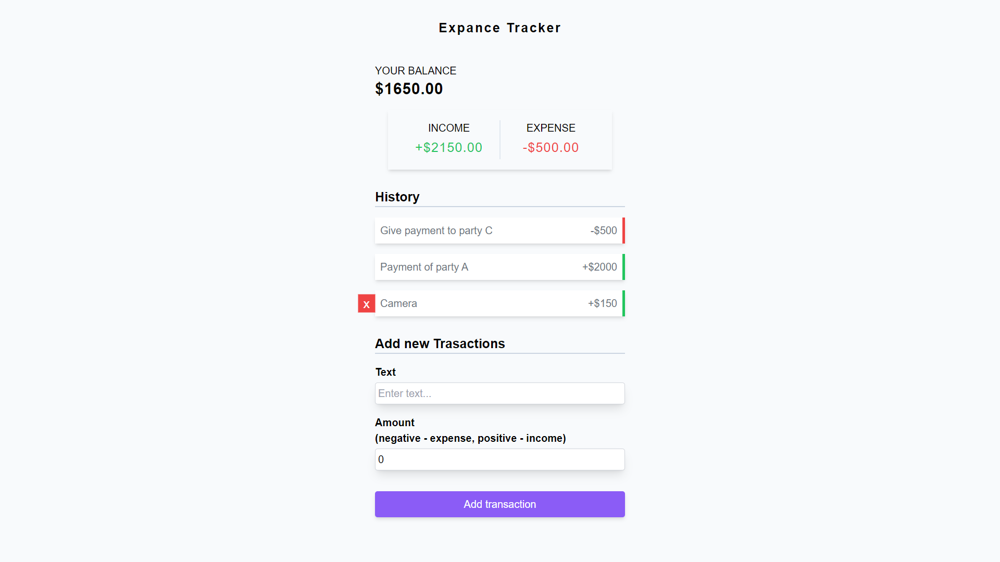

# Expense Tracker



## Table of Contents

- [Description](#description)
- [Features](#features)
- [Installation](#installation)
- [Usage](#usage)
- [Contributing](#contributing)

## Description

Expense Tracker is a simple web application built with React.js and Tailwind CSS. It leverages React Context API and `useReducer` hooks to manage global state efficiently, allowing users to add and delete transactions and view the total income and expenses.

## Features

- **Add Transaction:** Users can easily add their transactions, whether it's income or an expense.

- **Delete Transaction:** Transactions can be deleted with a simple click, providing a smooth user experience.

- **Total Income and Expense:** The application provides a clear overview of the total income and total expenses.

## Installation

1. Clone the repository:

   ```bash
   git clone https://github.com/pritkheni/Expense-tracker-app

   ```

2. Change into the project directory:

   ```bash
   cd expense-tracker

   ```

3. Install dependencies:

   ```bash
   npm install

   ```

4. Start the development server:
   ```bash
   npm run dev
   ```

## Contributing

Contributions are welcome! Feel free to fork the repository, make your changes, and submit a pull request.
